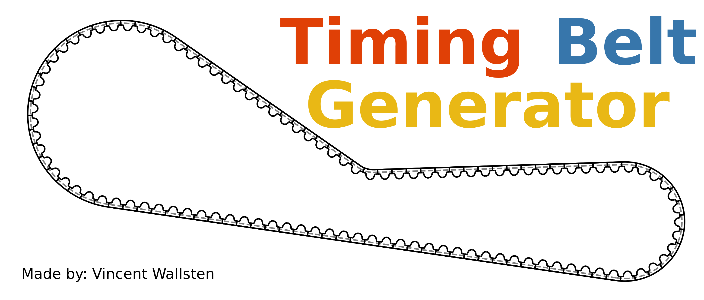

# Source code for my Fusion 360 Timing Belt Generator

This repo contains all the source code for my Fusion 360 script. The script is pretty robust, but far from perfect. It can generate most timing belt drives successfully, but there are edge cases that it cannot handle due to simplifying assumptions I made during development. 

The belt generation happens entirely within the Python backend, based on my previous projects: `beltpy` and `pybeltsolver`. This is the main limiting factor of the script, as it can only generate belts with a specific set of properties. See the `pybeltsolver` repo for more details regarding this. There are also lower bound limits set for the tooth count and smooth pulley diameter in the `config.py` file to avoid issues during generation.

The script currently supports the following profiles:

* GT2 profiles with a 2 mm pitch
* GT3 profiles with a 3 mm pitch

More may be added in the future based on popular demand. You may also add your own profiles if you want. The procedure to do so is identical to the one described in the documentation for `pybeltsolver`.

# Example

Below is a video demonstrating the script in action. Note that the value entered for "toothed" pulleys is the physical tooth count, while the value entered for the "smooth" tensioner pulley is the desired diameter in mm.

<video src="https://github.com/user-attachments/assets/c4fbc2e5-757e-42ea-b348-9093ce6b3d49" width="100%" autoplay loop muted playsinline></video>

